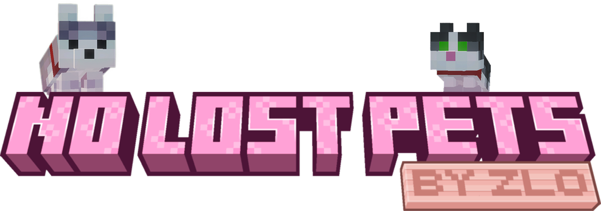

# NoLostPets

---

---

> Bring lost pets back without loading the chunk they were lost in.

> Safe. Automatic. Server-side.

---

## What is this?

**A Fabric pet recall mod for pets that got stranded in unloaded chunks.**

It can recover supported companion pets even when vanilla follow logic cannot, because the pet is no longer loaded.

---

## Why use it?

This mod is for cases where:

* your pet got left behind after long travel
* you changed dimension or died and respawned
* the pet is too far away to be loaded
* you want recovery without loading the original chunk

If the real problem is "my pet is lost somewhere outside simulation distance", this mod is built for that.

---

## Features

* Recalls pets from unloaded chunks without loading the source chunk
* Recalls already loaded pets too
* Uses safe vanilla-style placement near the player
* Allows short grass as empty space but avoids water, fluids, and leaves
* Skips sitting pets
* Same-dimension only, with ownership checks for every recall path
* Automatic recall checks on join, respawn, dimension change, chunk movement, landing, and large movement
* Works on dedicated servers
* Only the server needs it on dedicated servers
* Supports vanilla tameables and many modded companion pets
* Cleans up stale pet records after repeated misses
* Includes admin stats, rescan, and built-in verify/self-test commands
* One universal jar for Minecraft `1.21.8 - 1.21.11`

---

## Commands

Admin/operator commands:

* `/petrecall force <player>`
* `/petrecall rescan <player>`
* `/petrecall stats`
* `/petrecall stats <player>`
* `/petrecall verify singleplayer`
* `/petrecall verify multiplayer <otherPlayer>`
* `/petrecall verify status`
* `/petrecall verify cancel`

---

## Supported pets

* Vanilla tameable companion mobs
* Many modded pets with normal owner UUID and sitting/follow NBT

Not supported:

* horses
* donkeys
* mules
* llamas
* camels
* other mount-style tamed mobs

---

## Installation

### Dedicated server

1. Install Fabric Loader
2. Install Fabric API
3. Put `NoLostPets` into the server `mods` folder
4. Start the server

Clients do not need the mod on a dedicated server.

### Singleplayer

1. Install Fabric Loader
2. Install Fabric API
3. Put the mod into your local `mods` folder
4. Launch the game

---

## FAQ

### Does this load the chunk where the pet was lost?

No. That is the whole point of the unloaded-chunk recall path.

---

### Is this a server-side mod?

Yes. On dedicated servers, only the server needs it.

---

### Does it work in singleplayer?

Yes.

---

### Does it support modded pets?

Many do, if they use normal owner and sitting/follow data.

---

### Does it recall sitting pets?

No. Sitting pets are skipped.

---

### Does it teleport pets between dimensions?

No. Cross-dimension recall is intentionally blocked.

---

### Does it support horses or mounts?

No. Mount-style tamed mobs are intentionally excluded.

---

## Additional Info

* Supports Minecraft `1.21.8 - 1.21.11`
* Fabric only
* Universal jar across all supported `1.21.x` versions
* GPL-3.0-only
