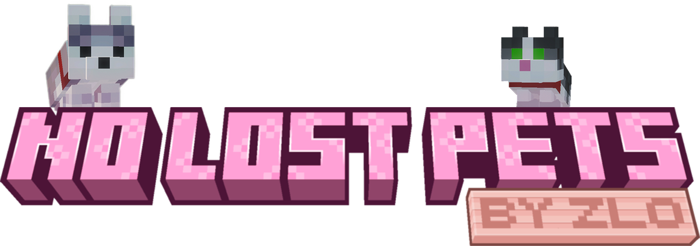

# NoLostPets




> Bring lost companion pets back to their owner.
>
> Safe. Automatic. Server-side. Built for real lost pets.

NoLostPets is a Fabric mod that recalls companion pets from loaded and unloaded chunks. Minecraft loads the source chunk, and the mod moves the existing entity to its owner.

The `mc-26x` branch builds a separate candidate jar for each Minecraft target from `26.1` through `26.3`. Fabric GameTests cover recall behavior and automatic batches on each target. The `main` branch retains the `1.21.x` implementation.

## What Is This?

**A server-side pet recall mod for pets that got left behind.**

- No minimap.
- No client UI.
- No teleporting random tamed mobs you do not own.
- Recovers pets outside simulation distance.

It is meant for companion-style pets that should follow a player but can end up stuck in unloaded chunks after travel, death, portals, or server movement.

## Why Use It?

Vanilla follow logic only helps when the pet is already loaded.

NoLostPets is for servers and singleplayer worlds where:

- pets get stranded far away
- owners change dimension or respawn
- travel unloads the original chunk
- you want recovery of a pet outside simulation distance

If the real problem is "my pet is lost somewhere outside simulation distance", this mod solves that problem directly.

## Features

- Temporarily loads source chunks with loading-only tickets and recalls existing pets through Minecraft.
- Loads at most four source chunks concurrently, with a 200-tick timeout per request.
- Recalls already loaded pets too.
- Uses safe vanilla-style placement checks near the owner.
- Treats short grass as valid empty space and avoids water, fluids, and leaves.
- Skips sitting pets.
- Skips pets carrying passengers or riding another entity.
- Blocks cross-dimension recall on purpose.
- Preserves ownership checks for both loaded and unloaded recall paths.
- Works automatically in the background for unloaded pets.
- Triggers automatic checks on join, respawn, dimension change, chunk movement, landing, and major movement.
- Uses a delayed join warmup and optional owner-only repair scan instead of heavy immediate work.
- Batches unloaded recalls and throttles retries/backoff to reduce server spikes.
- Keeps per-world pet index data on the server.
- Cleans up stale records after repeated misses.
- Supports vanilla tameables and many modded pets with standard owner/sit NBT.
- Includes built-in admin stats and verify/self-test commands.
- Builds a separate jar with an exact Minecraft version dependency for each target.

## Commands

All commands require admin/operator permission.

- `/petrecall force <player>`
  Recalls the player's indexed pets, including loaded and unloaded pets.
- `/petrecall rescan <player>`
  Re-indexes currently loaded pets owned by that player.
- `/petrecall stats`
  Shows global runtime/index stats.
- `/petrecall stats <player>`
  Shows stats scoped to one player.
- `/petrecall verify singleplayer`
  Runs the built-in singleplayer self-test suite.
- `/petrecall verify multiplayer <otherPlayer>`
  Runs the ownership-focused multiplayer self-test suite.
- `/petrecall verify status`
  Shows current verify/self-test progress.
- `/petrecall verify cancel`
  Stops the active verify/self-test run.

## How It Works

### Recall Behavior

- Loaded pets are teleported to a safe spot near the owner.
- Unloaded pets are loaded with a temporary loading-only ticket, then the existing entity is teleported. The recall ticket does not request simulation ticks.
- Placement prefers safe walkable positions near the player.
- Short grass is considered valid empty space, while water, fluids, and leaves are rejected.
- If no valid safe spot exists, recall fails instead of spawning the pet into a bad location.
- Pets are never recalled across dimensions.

### Automatic Recall

- Automatic recall selects unloaded pets when a check starts.
- Pets must belong to the player, be in the same dimension, and not be sitting.
- Automatic checks happen after join, respawn, world change, chunk movement, landing, and large travel events.
- Automatic runs are throttled and batched so the server does not spam recall work every tick.
- The selected group stays queued across batches of at most 16 pets, including pets loaded by earlier batches. No further movement is needed to finish the queue.
- Jumping pauses the queue until landing; each teleport still checks current ownership and sitting state.
- Join uses a short warmup and can do an owner-only loaded-pet repair scan when the index is empty.

### Pet Detection

- Vanilla `TamableAnimal` mobs are supported directly.
- Many modded pets are supported if they expose normal owner UUID and sitting/follow signals in NBT.
- Tamed mounts such as horses, donkeys, mules, llamas, camels, and similar `AbstractHorse` mobs are intentionally excluded.

### Stale Record Handling

- The server stores indexed pet records in persistent world data.
- When a record points to a pet that can no longer be found, the mod quarantines retries with backoff.
- After three consecutive misses, the stale record is removed automatically.

### Verification And Debugging

- Built-in verify commands can exercise loaded recall, unloaded recall, sitting-pet skips, ownership protection, safe-spot rules, auto-recall speed, batch recall, and stale-record cleanup.
- GameTests also cover 40 pets in one unloaded chunk, 60 standing and 20 sitting pets across five distant chunks, a failed first batch, and jumps between batches or during chunk loading.
- `stats` commands expose indexed/runtime counters for live debugging.
- Extra file tracing is available with `-Dnolostpets.debug=true`.

## Compatibility

| Minecraft | Fabric API | Status |
| --- | --- | --- |
| `26.1` | `0.145.1+26.1` | Candidate; GameTests passed |
| `26.1.1` | `0.145.4+26.1.1` | Candidate; GameTests passed |
| `26.1.2` | `0.155.3+26.1.2` | Candidate; GameTests passed |
| `26.2` | `0.161.0+26.2` | Candidate; GameTests passed |
| `26.3` | `0.162.0+26.3` | Candidate; GameTests passed |

These targets require Java `25`, Fabric Loader `0.19.5` or later, and the matching Fabric API. Each jar declares one exact Minecraft version.

## Installation

### Dedicated Server

1. Install Fabric Loader for your Minecraft version.
2. Install the matching Fabric API version.
3. Put the matching `NoLostPets` jar into the server `mods` folder.
4. Start the server.

Clients do not need the mod on a dedicated server.

### Singleplayer

1. Install Fabric Loader and Fabric API.
2. Put the jar into your local `mods` folder.
3. Launch the game.

Singleplayer works because the integrated server runs the mod locally.

## FAQ

### Does this load the chunk where the pet was lost?

Yes, temporarily. Minecraft loads the source chunk and its entities. The recall ticket requests loading rather than simulation, and is removed after success, failure, or cancellation. Other tickets can still cause normal simulation there.

### Is this server-side?

Yes. On dedicated servers, only the server needs the mod.

### Does this work in singleplayer?

Yes. Singleplayer uses the integrated server.

### Does it support modded pets?

Many do, as long as they behave like companion pets and expose normal owner/sitting data.

### Does it recall sitting pets?

No. Sitting pets are skipped on purpose.

### Does it teleport pets between dimensions?

No. Cross-dimension recall is intentionally blocked.

### Does it support horses or other mounts?

No. Mount-style tamed mobs are intentionally excluded.

### Where is pet data stored?

In the world save as server persistent state under the mod's saved data.

## Build From Source

Use JDK `25`. The Gradle wrapper selects Gradle `9.6.0`; Loom `1.17.21` uses Minecraft's official, unobfuscated names.

On Windows, compile the mod, unit tests and GameTest sources, then package all five targets:

```powershell
.\scripts\build-26x.ps1
```

For one target:

```powershell
.\scripts\build-26x.ps1 -Versions 26.3 -JavaHome 'C:\Program Files\Eclipse Adoptium\jdk-25.0.2.10-hotspot'
```

Candidates, source jars, and SHA-256 files are written to `build/candidates/<version>/`. For example: `NoLostPets-1.2.0+mc26.3.jar`. This script compiles tests but does not execute them, launch Minecraft, or publish artifacts.

## Local Test Clients

Run a client explicitly:

```powershell
.\scripts\run-client.ps1 -Version 26.3
```

Runtime files are isolated under `run/<version>/<run-name>/`; the default client directory is `run/26.3/client/`. Worlds are never linked between versions. Use copies of worlds for upgrade verification.

The following commands execute tests when verification is authorized:

```powershell
.\scripts\verify-all.ps1
.\scripts\smoke-client.ps1 -Version 26.3
.\scripts\smoke-lan.ps1 -Version 26.3 -WorldName Testing
```

`verify-all.ps1` requires exit code zero, a successful Gradle build, the complete discovered GameTest count, and JUnit reports with all discovered tests executed and no failures, errors, or skips. A timeout or missing result fails verification. Logs are stored under `build/tmp/verify-all/`.

To verify saved-world upgrades with an old production JAR, keep the `main` checkout beside this checkout and run:

```powershell
.\scripts\verify-world-upgrades.ps1 -BaselineJar '..\pet-recall\dist\1.21x\NoLostPets-fabric-1.21.11.jar'
```

This creates a disposable world on Minecraft 1.21.11 using the supplied old mod. It upgrades offline copies directly to 26.3 and through 26.1, 26.1.1, 26.1.2, 26.2 and 26.3, with a separate server restart after every upgrade. It checks the saved index before loading distant chunks, then checks six pets, two owners, both dimensions and an ordinary neighbor. Finally it recalls pets within each dimension and restarts again to check the resulting save. Health, custom names, tags, collars, UUIDs, ownership, sitting state and duplicate entities are checked. Reports include the actual mod version and JAR hash under `build/world-upgrades/<run>/`. The source world must remain byte-for-byte unchanged.

JDK 21 and 25, cached Minecraft/Fabric dependencies and the five packaged candidates are required. The helper mods are built separately from `src/upgradeTest/`; production JARs do not include them. The script downloads dedicated server launchers from Fabric. Custom companion mods and client/LAN behavior are outside this saved-world test.

LAN verification starts two isolated clients. Its host world must already exist at `run/26.3/26.3-lan-host/saves/Testing/`. Create a disposable test world there with `run-client.ps1 -Version 26.3 -RunName 26.3-lan-host` before running LAN verification.

## Index Migration

When the new index is absent, the mod reads legacy `pet_recall_index.dat` files, validates every record, saves through Minecraft, and reads the result back before enabling recall. The legacy file is retained. An existing new index always takes precedence, so a restart cannot restore a removed pet or undo an ownership change by importing the old file again.

Unreadable files, invalid records, conflicting legacy indexes, and failed writes disable index operations for that server session. The server log explains the failure; commands report that the index is unavailable. Repair the data and restart before trying again.

## Debug Logging

NoLostPets can write a dedicated trace file at `logs/NoLostPets-debug.log` inside the current game or server directory.

By default this trace is enabled in development environments. For normal server runs, enable it explicitly with:

```text
-Dnolostpets.debug=true
```

For a default local client run, the trace is stored at `run/26.3/client/logs/NoLostPets-debug.log`.

## Project Layout

- `src/main/` contains the mod logic, commands, tracking, recall service, and mixins.
- `src/gametest/` contains Fabric game tests.
- `src/compat/` contains the version-specific entity constants and LAN publishing calls used by verification tools.
- `src/test/` contains unit tests, including migration failure and restart scenarios.
- `scripts/versions.ps1` defines the five dependency combinations used by build and verification scripts.
- `FABRIC_COMPATIBILITY_NOTES.md` lists this branch's dependency matrix and verification status.

## License

This project is licensed under `GPL-3.0-only`. See [LICENSE](LICENSE).
